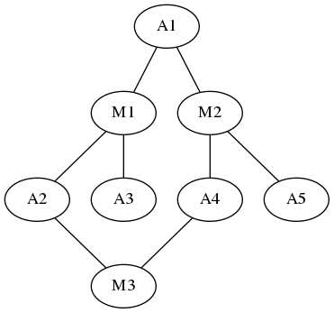
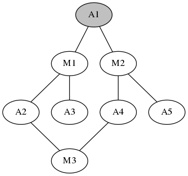
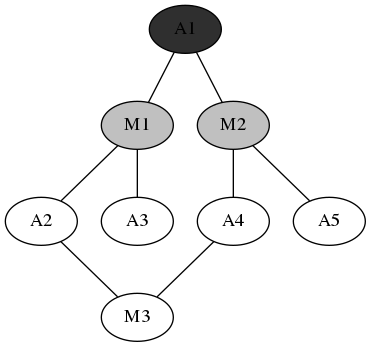
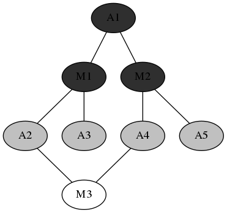

# 数据集

数据集是上映电影和演员数据，共有70万部电影，96万位演员。首先进行预处理和统计，将原数据集处理成“演员+出演电影列表”和“电影+演员列表”两个数据文件。统计得到平均每个演员出演3.99部电影，每个电影平均有8.5个演员。

# 算法



上图是算法采用的模型，其中A表示演员，M表示电影，演员出演电影则两个节点存在一条边。所有数据构成一个无向有环图，问题转化成在图中查找两个A节点之间的路径。

Breadth-First-Search算法伪代码:

```python
open=[source] close=[]
while(not found dest)
for s in open:
    open.add(s的后继节点sn,且sn不在close中)
    close.add(s)
end
```

灰色点表示open点，黑色点表示close点，白色点表示unknown点。





循环进行下去，直到发现目标节点，或者遍历深度达到上限值(6*2+1=13)。

# Hadoop实现

## 输入数据

所有节点及其子节点\<name, children\>;

已经处理过的节点\<name,children,distance,status,parent\>。

## Map阶段

所有节点发送\<name,children\>

已经处理过的节点发送\<name,distance,status,parent\> 

open节点发送\<child,distance,parent\>

## Reduce阶段

接收到children数据，用于组成新的open节点

接受到distance,status,parent数据，则已经是close节点

接收到parent's distance数据，则成为新的open节点

写入所有的close节点数据和新的open节点数据：\<name,children,distance,status,parent\>

# 优化

## 优化close节点数据

对于close节点，不再需要children,distance,status,parent数据，只需要保留name即可。能够减小写入文件大小和M-R之间传输的数据。

## 优化open数据

Map阶段所有节点都需要发送\<name,children\>数据，但是Reduce中只有新的open节点才需要这个数据。

上一轮中保存下一轮会open的节点name，Map的时候只发送新open节点的数据。通过CacheFile传送这个数据。

当然CacheFile文件不能太大，否则会heap溢出并且查询时间过长，这里取深度为6以上的时候就不再使用CacheFile，而是采用原来的办法发送所有数据。

# 结果

