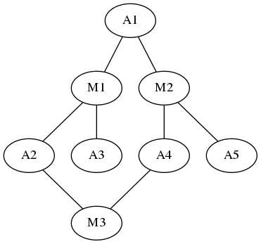
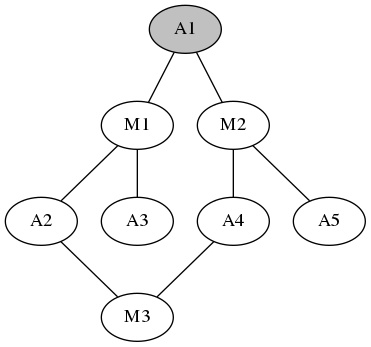
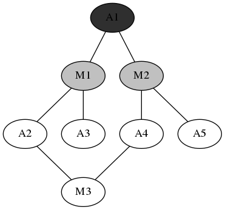
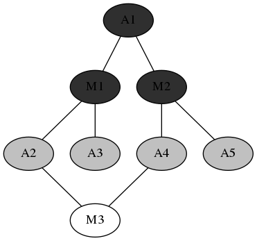
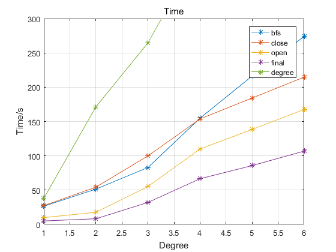
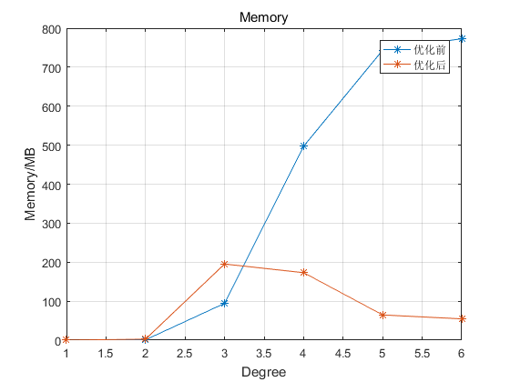

# 数据集

数据集是上映电影和演员数据，共有70万部电影，96万位演员。
首先进行预处理和统计，将原数据集处理成“演员+出演电影列表”和“电影+演员列表”两个数据文件。统计得到平均每个演员出演3.99部电影，每个电影平均有8.5个演员。

# 算法

{#fig:model width=35% height=250px}

图[-@fig:model]是算法采用的模型，其中A表示演员，M表示电影，演员出演电影则两个节点存在一条边。所有数据构成一个无向有环图，问题转化成在图中查找两个A节点之间的路径。采用Breadth-First-Search算法。

{#fig:bfs1 width=33% height=150px}
{#fig:bfs2 width=33% height=150px}
{#fig:bfs3 width=33% height=150px}

BFS

灰色点表示open点，黑色点表示close点，白色点表示unknown点。
循环进行下去，直到发现目标节点，或者遍历深度达到上限值(6*2+1=13)。

# Hadoop实现

## 输入数据

所有节点及其子节点\<name, children\>;

已经处理过的节点\<name,children,distance,status,parent\>。

## Map阶段

所有节点发送\<name,children\>

已经处理过的节点发送\<name,distance,status,parent\> 

open节点发送\<child,distance,parent\>

## Reduce阶段

接收到children数据，用于组成新的open节点

接受到distance,status,parent数据，则已经是close节点

接收到parent's distance数据，则成为新的open节点

写入所有的close节点数据和新的open节点数据：\<name,children,distance,status,parent\>

# 优化

## 优化close节点数据

对于close节点，不再需要children,distance,status,parent数据，只需要保留name即可。能够减小写入文件大小和M-R之间传输的数据。

## 优化open数据

Map阶段所有节点都需要发送\<name,children\>数据，但是Reduce中只有新的open节点才需要这个数据。

上一轮中保存下一轮会open的节点name，Map的时候只发送新open节点的数据。通过CacheFile传送这个数据。

当然CacheFile文件不能太大，否则会heap溢出并且查询时间过长，这里取深度为6以上的时候就不再使用CacheFile，而是采用原来的办法发送所有数据。

## 搜索索引信息

当前的搜索过程中，每一次迭代都需要读取当前的节点，进行全部节点的一次搜索，可以考虑通过预处理得到一些索引信息，能够减少搜索的深度和范围。比如预处理得到演员的一度表（即两个演员出演过同一部电影，他们的关系称为一度），这样利用索引信息只需要迭代最多六次就能够完成搜索。但是一度表相比原先的数据变得特别大，因为原先的父子节点关系现在变成了祖孙节点关系，中间节点的信息仍然需要存储。实际运行中，发现一度表的数据量是原先数据的60倍，虽然搜索深度降低了，但是巨大数据量带来的读文件，切片，分配给各个mapper带来的开销同样很大，最终结果得不偿失，也就停止了这方面的工作。

## 倒排索引缓存

想法来自于搜索引擎的规律，20%的内容能够满足80%的搜索。因此可以通过一定的方法找出最可能被用户搜索的一些演员，然后把这些演员的两两组合作为key，他们之间的路径(预先计算好)作为value，然后对于这些演员可以直接通过查找这个倒排索引表命中。现有数据集中可以利用的数据有电影名字，演员名字，出演时间，演员角色在电影中的排名。综合考虑决定利用演员出演电影数量和角色排名两个信息，前者保证了演员能够较多的出现在荧幕中，后者保证了演员在电影中的地位较重要。最终使用的公式为:
$$
Score(actor)=\sum_{m \in MovieList}\frac{1+number_m-rank_m}{number_m}
$$
其中MovieList是actor所有出演的电影，number是电影中角色总数量，rank表示actor在电影中的排名。但是数据集中部分rank信息缺失，通过人为观察计算结果，发现缺失情况下当期项取$\frac{1}{2}$较好，即默认演员在电影中排名居中。用户查询的时候，首先搜索是否在倒排索引表中，命中时间少于100ms，即使不命中，这个开销也是特别小的。

## 去除干扰数据

数据集中存在一些娱乐和新闻等类型的剧集，比如美国早间新闻，演员列表中包含了很多电影明星，我们认为这种情况下并不能算作两个演员互相认识，视为干扰数据。干扰数据的最大特征就是演员数量巨多，剧集持续时间较长，排序后再结合剧集的介绍信息，去除了干扰数据。

# 结果

{#fig:time  height=250px}

{#fig:mem height=250px}

时间开销和空间开销

# 总结

这次实验选择了自己感觉很有趣的项目，熟悉了分布式系统下BFS算法的实现和优化方向，通过一点一点的多方面的优化，能够在160s之内完成搜索。实验还发现大部分的演员满足四度关系，也验证了六度分割理论。